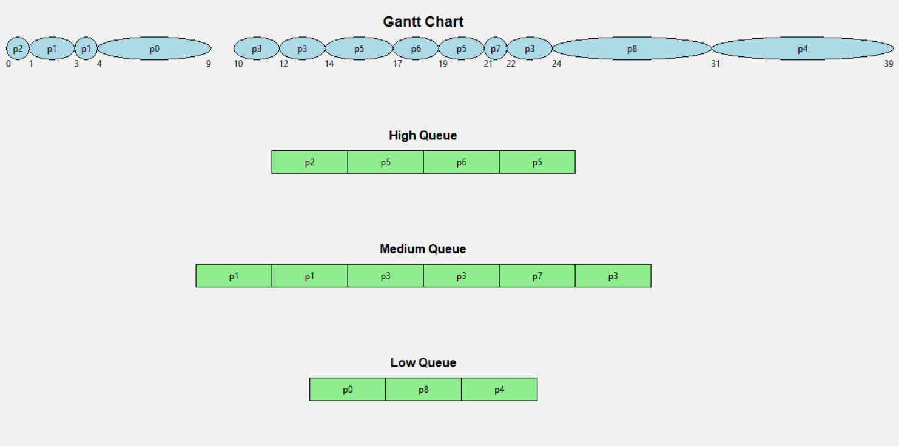
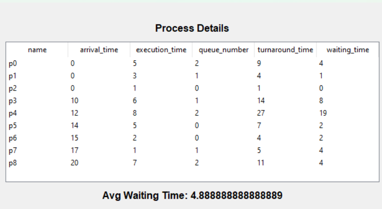

# Multilevel Queue (MLQ) CPU Scheduling

## Description
The MLQ CPU scheduling algorithm consists of three queues:
1. High Priority Queue (Priority 0): Scheduled using Round Robin with quantum (q) = 3.
2. Medium Priority Queue (Priority 1): Scheduled using Shortest Remaining Time First (SRTF) with quantum (q) = 2.
3. Low Priority Queue (Priority 2): Scheduled using Shortest Job Next (SJN).

## Input
The input consists of processes with the following attributes:
- Process name (e.g., p0, p1, ...)
- Arrival time (integer)
- Execution time (CPU Burst time) (integer)
- Queue number (0, 1, or 2)

## Output
The output describes each event that occurs during the CPU scheduling process, including process arrivals, queue transitions, and kernel interactions.

Example Output:
- At t = 0, p0 arrived in the queue.
- p0 entered the kernel.
- At t = 1, p1 arrived in the queue.
- At t = 3, p0 left the kernel and entered the queue.
- p1 entered the kernel.
- ...

Additionally, the output includes the waiting time for each process and the average waiting time.

## GUI
GUI that displays a kernel diagram and the ready queue.

## Contributors
This project was completed by:
- [Menna Allah Saed](https://github.com/menna2002)
- [Aya Ahmed](https://github.com/AyaAhmed50)

## nbviewer link
https://nbviewer.org/github/Menna2002/MultilevelQueue/blob/master/MLQ.ipynb
